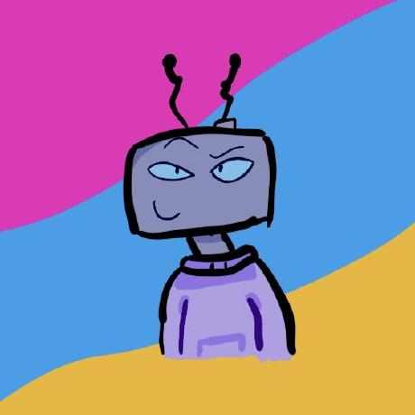

 <h3>Hey, I'm Intense!</h3> 
A developer from Germany with a background in game developement, currently building websites, minecraft mod, a programming language and challenge minecraft data packs. In my free time I like to contribute to open source stuff, like [Modrinth](https://github.com/modrinth/code) or [Koster](https://github.com/KosterLang).

Forked from <a href="https://github.com/creeperkatze/creeperkatze/blob/7f414874bc542fe8814d50203e70630a2036d0ca/README.md">creeperkatze/creeperkatze</a>
